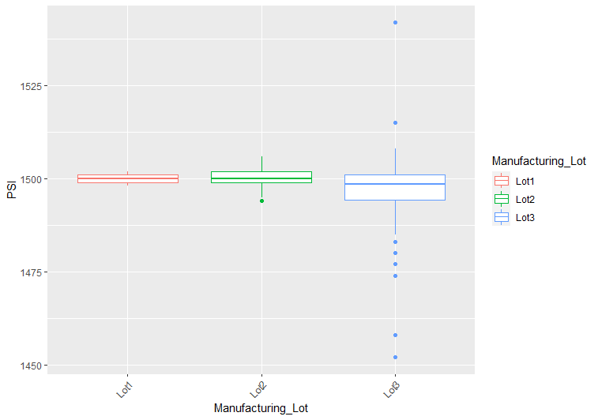

# MechaCar_Statistical_Analysis
AutosRUs’ newest prototype, the MechaCar, is suffering from production troubles that are blocking the manufacturing team’s progress. AutosRUs’ upper management has asked for a review of the production data for insights that may help the manufacturing team.

The goal of this effort is to utilize data analytics to do the following:

* Perform multiple linear regression analysis to identify which variables in the dataset predict the mpg of MechaCar prototypes
* Collect summary statistics on the pounds per square inch (PSI) of the suspension coils from the manufacturing lots
* Run t-tests to determine if the manufacturing lots are statistically different from the mean population
* Design a statistical study to compare vehicle performance of the MechaCar vehicles against vehicles from other manufacturers. 

## Technology Involved
The technology utilized to accomplisth the above deliverables is the "R" programming language from within RStudio.

## Linear Regression to Predict MPG
The first set of production data is a listing of 50 different prototypes of the MechaCar.  The following is a representation of the data contained in the table:

Linear Regressions show the relationship between a dependent variable and one or more independent variables.  The dependent variable in this case is miles per gallon (MPG) or the fuel efficiency of the MechaCar prototypes.  Independent variables that could have some impact on MPG are vehicle length, vehicle weight, the angle of the spoiler, ground clearance and drive train (AWD or not).  The linear regression predicts whether or not any of these independent variables could cause increase or decrease in MPG.

### P-Values of Independent Variables
According to the above plots for visual reference and Summary Statistics of our linear regression test, the following independent variables provided significant non-random amount of variance to the mpg values in the dataset.  This is known by the "P-Value", which generally is used to indicate whether the probability of correlation when significant is some number less than 0.05:
* vehicle length; **P-Value of 2.60e-12**
* ground clearance; **P-Value of 5.21e-08**

Note:  vehicle weight also likely has some impact, but the significance is only slight; P-Value of 0.0776

The following independent variables did not show non-random effect on MPG:
* Spoiler Angle; P-Value of 0.3069
* AWD; P-Value of 0.1852

It should also be noted that the (Intercept) is also showing non-random amount of variance to the mpg values with a **P-Value of 5.08e-08**.  Per bootcamp text,
 > **When an intercept is statistically significant, it means there are other variables and factors that contribute to the variation in MPG that have not been included in our model. These variables may or may not be within our dataset and may still need to be collected or observed.**

### Multiple R-squared
The slope of the linear model **IS NOT** considered to be zero. This is because of the statistic "Multiple R-Squared" which has a value in this case of **.7149.  This is a strong reading of the slope moving away from zero toward 1, which indicates that predictive capability of the analysis is strong.

### Predictive Reliability
While this linear model does show some strength toward predictability of mpg of MechaCar prototypes, there is still room for improvement.  While the Multiple R-Squared figure indicates 71% likelihood of predictability, as indicated above, the Intercept indicates that there are additional independent variables not in the data set still left to discover that have impact on MPG.

## Summary Statistics on Suspension Coils

[Coils_Table](Resources/Suspension_Coils_Table.png)

The design specifications for the MechaCar suspension coils dictate that the variance of the suspension coils must not exceed 100 pounds per square inch. The question we shall explore is, does the current manufacturing data meet this design specification for all manufacturing lots in total and each lot individually?

The summary statistics of the total population does indicate the population of suspension coils do not exceed 100 pounds per square inch with a variance reading of 62.29.

However, when you look at the statistics or the box plot by Lot, a different story emerges.

Clearly, there is a problem with the 3rd Lot.  The variance for Lot 3 does not fall within 100 PSI, but is as high as 170 PSI.  A review of materials or manufacturing process associated with Lot 3 should be undertaken immediately.  This lot falls outside of the PSI allowable tolerance.

## T-Tests on Suspension Coils
T.Tests can be used to test the following hypotheses:
> * H0 : There is no statistical difference between the observed sample mean and its presumed population mean.
> * Ha : There is a statistical difference between the observed sample mean and its presumed population mean.

The T.Test verifies that the Lot 1 Mean PSI is statistically different from the Mean of the population with a P-Value of 1.568e-11.  This would indicate that the population does have some variance.  In this case, the alternative hypothesis is supported.

The T.Test verifies that the Lot 2 Mean PSI is statistically different from the Mean of the population with a P-Value of .0005911.  This would indicate that the population does have some variance.  In this case, the alternative hypothesis is supported.

The T.Test verifies that the Lot 3 Mean PSI is NOT statistically different from the Mean of the population with a P-Value of .1589.  This would indicate that the population does have some variance and that the source of the variance exists in Lot 3.  In this case, the null hypothesis is supported.

## Study Design: MechaCar vs Competition

While this study has provided some good insights about which factors affect MPG and discovered problems with coil production, a more thorough study of factors such as cost, fuel efficiency, maintenance cost and safety ratings of MechaCar compared to competitive products in the same class as MechaCar might prove more informative for the leadership team.  It is recommended that a study comparing MechaCar to competitors in the following areas be performed:

* MSRP,
* Actual Sales Price,
* fuel efficiency, 
* maintenance cost
* package features and 
* saftety rating.

### Requested Data
#### Dataset "A"
For starters, I would want a full database of all new cars sold in the same class as the MechaCar for the previous 5 years.  This table should include MSRP, Actual Sales Price, fuel efficiency, package/features tier and safety rating.  The table should also include purchaser demographics information (year born, gender and annual income)

#### Dataset "B"
A second table should include the maintenance and repair records of all cars sold in the same class as the MechaCar over the previous 5 years.  Data elements should include manufacturer, make/model, date purchased, date of service, mileage readings at time of service, cost of repair or maintenance, descriptor of repair or maintenance needed and a boolean yes/no indicating all manufacturer recommended service has been performed as expected.

### Analysis "A"
#### Metrics to be Tested
There are many tests that could be pursued with this set of data.  For brevity, I'll discuss analysis to determine if mark-downs from MSRP are different for any particular manufacturer and by package tier than the overall population.  

To perform the analysis, I would mutate the table to create a calculated column of MSRP minus summary statistics.  I would mutate a second column to create a percentage for each markdown for every car sold.  I would then summarize the (mean, median, variance, standard deviation) of the markdown percentage calculated field for the population of all cars sold.  I would want the same metrics for subsets, filtered or grouped by manufacturer.

#### Tested Hypotheses
H-0:  The means of markdown percentages for all groups are equal.

H-1:  At least one of the means of markdown percentages are different from all of the other groups.

#### Statistical Tests and Needed Data
The test used will be the two-way ANOVA test.  The dependent variable is the the markdown percentage.  The independent variables are manufacturer and package tier.

### Analysis "B"
#### Metrics to be Tested
Again, many tests could be selected.  For brevity, analysis will be performed to see if there is a difference in overall cost to operate cars by manufacturer.  Overall cost to operate is depicted by the the total cost of recommended maintenance and any unscheduled repairs.

To perform the analysis, a new column would be mutated to the table to calculate the total costs of all recommended maintenance and unscheduled repairs.  The mean, median, variance and standard deviation would be summarized for the total operating costs for the population (filtered for all records having met manufacturer recommended service milestones) as well as each sub group, which is the population grouped-by manufacturer and filtered to include all records where the all manufacturer recommended services = yes.

#### Tested Hypotheses
H-O:  There is no statistical difference between the observed sample mean and its presumed population mean (each manufacturer vs population).

H-1:  There is a statistical difference between the observed sample mean and the presumed population mean (each manufacturer vs population).

#### Statistical Tests and Needed Data
As indicated above, the summary statistics would be performed for the population and each manufacturer, filtered sub-group.  A one-sample t-test will be performed for each manufacturer sub-group vs the population.

## Conclusion
While there are so many ways this data could be analyzed, the two tests described could provide information to the leadership team at AutosRUs to help them know what guidance to provide to dealers about what price levels are appropriate as compared to competitors.  Also, the data could also indicate the overall cost to operate for competitors and assist with goal setting for the MechaCar or influence decisions about parts selection or maintenance programs that could be sold along with the MechaCar when it rolls out to the show rooms.
