# MechaCar_Statistical_Analysis
AutosRUs’ newest prototype, the MechaCar, is suffering from production troubles that are blocking the manufacturing team’s progress. AutosRUs’ upper management has asked for a review of the production data for insights that may help the manufacturing team.

The goal of this effort is to utilize data analytics to do the following:

* Perform multiple linear regression analysis to identify which variables in the dataset predict the mpg of MechaCar prototypes
* Collect summary statistics on the pounds per square inch (PSI) of the suspension coils from the manufacturing lots
* Run t-tests to determine if the manufacturing lots are statistically different from the mean population
* Design a statistical study to compare vehicle performance of the MechaCar vehicles against vehicles from other manufacturers. 

## Technology Involved
The technology utilized to accomplisth the above deliverables is the "R" programming language from within RStudio.

## Linear Regression to Predict MPG
The first set of production data is a listing of 50 different prototypes of the MechaCar.  The following is a representation of the data contained in the table:
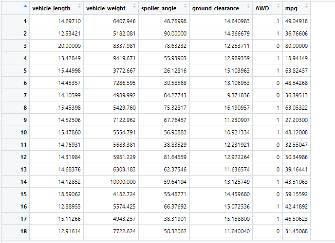

Linear Regressions show the relationship between a dependent variable and one or more independent variables.  The dependent variable in this case is miles per gallon (MPG) or the fuel efficiency of the MechaCar prototypes.  Independent variables that could have some impact on MPG are vehicle length, vehicle weight, the angle of the spoiler, ground clearance and drive train (AWD or not).  The linear regression predicts whether or not any of these independent variables could cause increase or decrease in MPG.
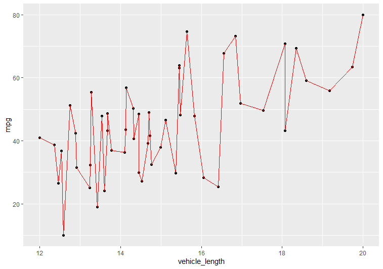
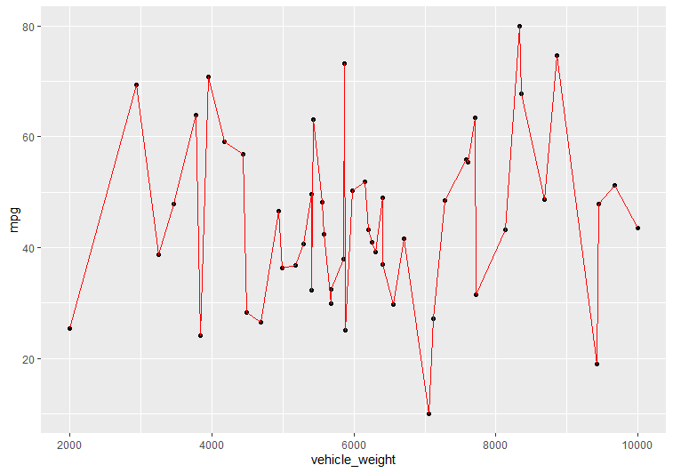
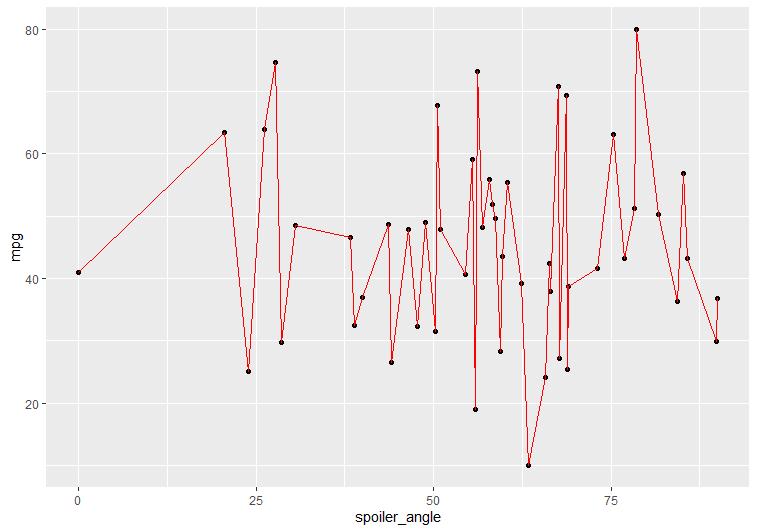
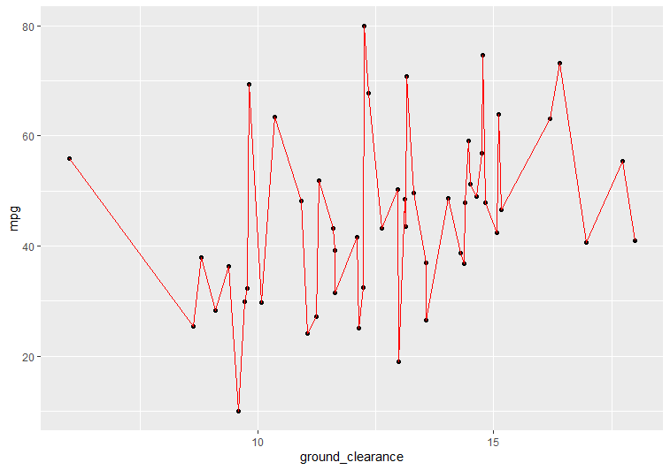
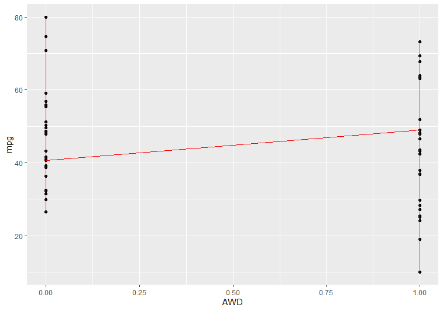
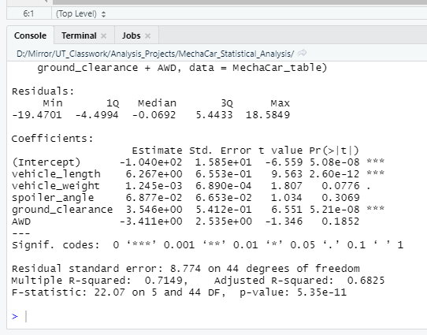

### P-Values of Independent Variables
According to the above plots for visual reference and Linear Regression output of our linear regression test, the following independent variables provided significant non-random amount of variance to the mpg values in the dataset.  This is known by the "P-Value", which generally is used to indicate whether the probability of correlation when significant is some number less than 0.05:
* vehicle length; **P-Value of 2.60e-12**
* ground clearance; **P-Value of 5.21e-08**

Note:  vehicle weight also likely has some impact, but the significance is only slight; P-Value of 0.0776

The following independent variables did not show non-random effect on MPG:
* Spoiler Angle; P-Value of 0.3069
* AWD; P-Value of 0.1852

It should also be noted that the (Intercept) is also showing non-random amount of variance to the mpg values with a **P-Value of 5.08e-08**.  Per bootcamp text,
 > **When an intercept is statistically significant, it means there are other variables and factors that contribute to the variation in MPG that have not been included in our model. These variables may or may not be within our dataset and may still need to be collected or observed.**

### Multiple R-squared
The slope of the linear model **IS NOT** considered to be zero. This is because of the statistic "Multiple R-Squared" which has a value in this case of **.7149.  This is a strong reading of the slope moving away from zero toward 1, which indicates that predictive capability of the analysis is strong.

### Predictive Reliability
While this linear model does show some strength toward predictability of mpg of MechaCar prototypes, there is still room for improvement.  While the Multiple R-Squared figure indicates 71% likelihood of predictability, as indicated above, the Intercept indicates that there are additional independent variables not in the data set still left to discover that have impact on MPG.

## Summary Statistics on Suspension Coils

[Coils_Table](Resources/Suspension_Coils_Table.png)

The design specifications for the MechaCar suspension coils dictate that the variance of the suspension coils must not exceed 100 pounds per square inch. Does the current manufacturing data meet this design specification for all manufacturing lots in total and each lot individually? Why or why not?

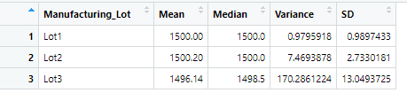

## T-Tests on Suspension Coils
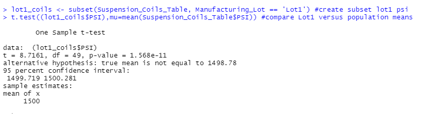
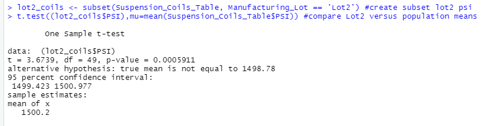
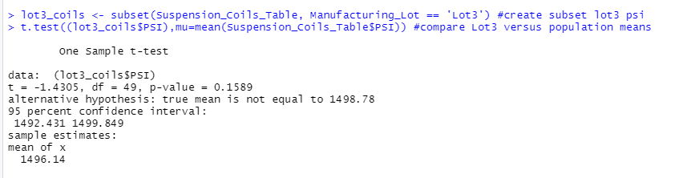

briefly summarize your interpretation and findings for the t-test results.

## Study Design: MechaCar vs Competition
Write a short description of a statistical study that can quantify how the MechaCar performs against the competition. In your study design, think critically about what metrics would be of interest to a consumer: for a few examples, cost, city or highway fuel efficiency, horse power, maintenance cost, or safety rating.
In your description, address the following questions:
What metric or metrics are you going to test?
What is the null hypothesis or alternative hypothesis?
What statistical test would you use to test the hypothesis? And why?
What data is needed to run the statistical test?